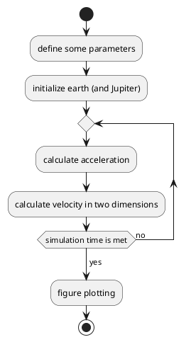

# Planning document

## Code Structure

```plantuml

@startuml

start

:define some parameters;
:initialize earth (and Jupiter);

repeat
  :calculate acceleration;
  :calculate velocity in two dimensions;

repeat while (simulation time is met) is (no)
->yes;
:figure plotting;
stop

@enduml
```
